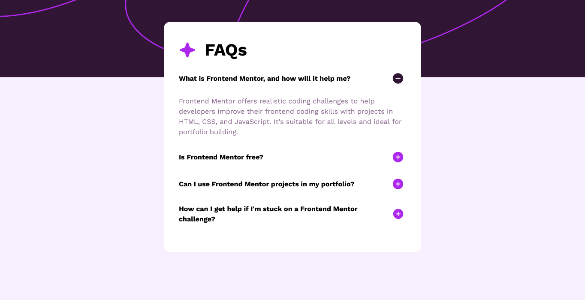

# Frontend Mentor - FAQ accordion solution

This is a solution to the [FAQ accordion challenge on Frontend Mentor](https://www.frontendmentor.io/challenges/faq-accordion-wyfFdeBwBz). Frontend Mentor challenges help you improve your coding skills by building realistic projects.

## Table of contents

- [Overview](#overview)
  - [The challenge](#the-challenge)
  - [Screenshot](#screenshot)
  - [Links](#links)
- [My process](#my-process)
  - [Built with](#built-with)
  - [What I learned](#what-i-learned)
  - [Continued development](#continued-development)
- [Author](#author)
- [Acknowledgments](#acknowledgments)

**Note: Delete this note and update the table of contents based on what sections you keep.**

## Overview

### The challenge

Users should be able to:

- Hide/Show the answer to a question when the question is clicked
- Navigate the questions and hide/show answers using keyboard navigation alone
- View the optimal layout for the interface depending on their device's screen size
- See hover and focus states for all interactive elements on the page

### Screenshot

### Links

- Solution URL: (https://github.com/Michael-mikeojj/Frontend-mentor-projects.git)
- Live Site URL: (http://faqaccordionpage.com/)

## My process

I first up marked up the HTML page structure
Then I styled it
And finally finished up the logic of the page

### Built with

- Semantic HTML5 markup
- CSS custom properties
- Flexbox
- CSS Grid
- Vanilla JavaScript

### What I learned

This is my first project where I incorporated and used JavaScript it was really exciting to get around the basic logic

### Continued development

I want to refine my coding skills with JavaScript

## Author

- Website - [michael Obiazikwor]
- Frontend Mentor - [@mikeojj](https://www.frontendmentor.io/profile/mikeojj)
- Twitter - [@mikeojj](https://www.twitter.com/mikeojj)

## Acknowledgments

I want to thank freeCodeCamp where I am currently learning how to code.
